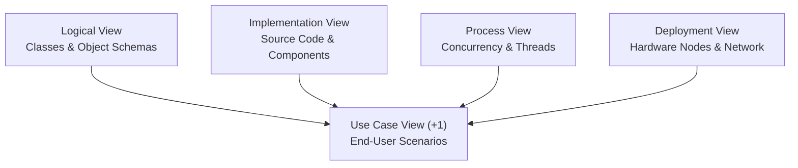
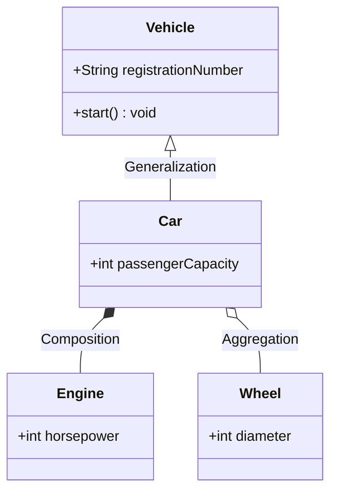
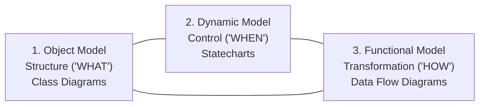
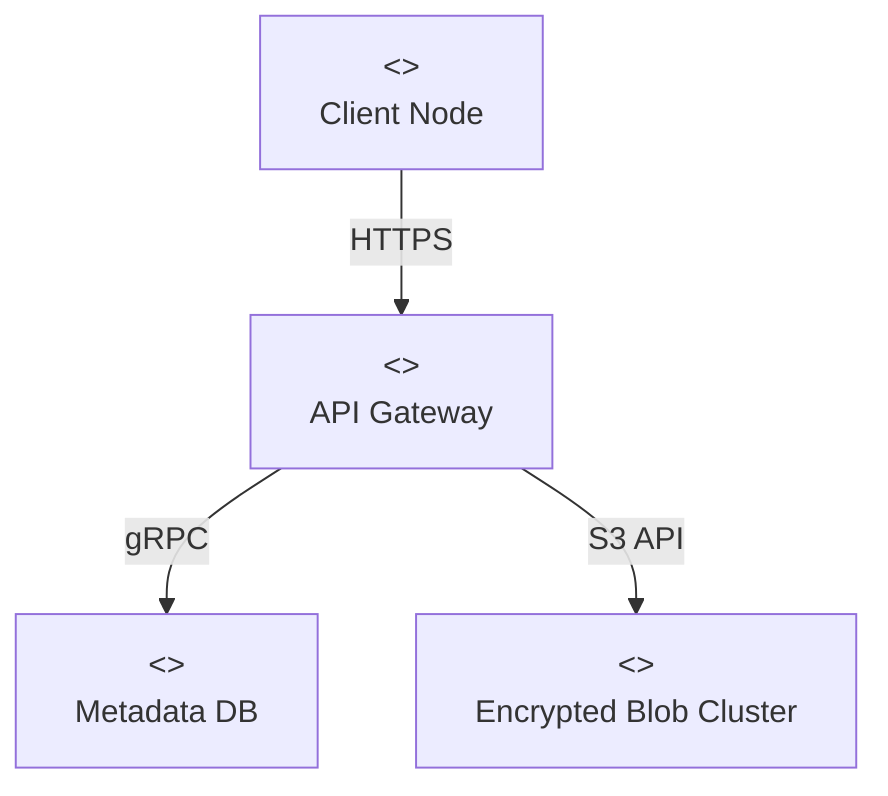
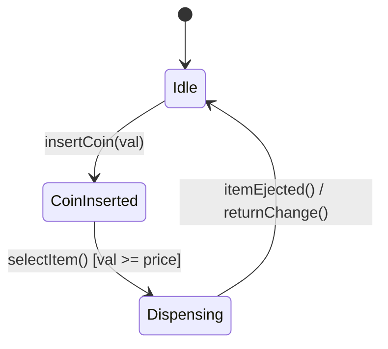

# Page 1: Index Page

| Section | Topic Title | Syllabus Coverage & Scope | Examination Weightage |
| :--- | :--- | :--- | :--- |
| **Page 1** | Index Page | Master structural mapping of curriculum, syllabus modules, and exam paper distribution. | Architectural Index |
| **Page 2** | Unit 1 Theory | Object-Orientation foundations, Object Identity, Encapsulation, Polymorphism, Generosity, Modeling Principles, Conceptual Model of UML, 4+1 View Architecture. | ~23 Marks / Paper |
| **Page 3** | Unit 2 Theory | Basic Structural Modeling (Classes, Relationships, Multiplicity, Aggregation, Generalization), Dynamic Interaction (Sequence & Collaboration), Behavioral (Use Case, Activity with Swimlanes, State Machine), Architectural (Component & Deployment). | ~28 Marks / Paper |
| **Page 4** | Unit 3 Theory | Stages of OOD, Rumbaugh OMT 3-Model Integration, Design Optimization (Algorithms, Paths, Inheritance Adjustment), Physical Packaging & Documentation, SA/SD vs JSD vs OOAD, Mapping OOP to C. | ~25 Marks / Paper |
| **Page 5** | Short Theory (2-Mark Concepts) | High-density core theoretical definitions and mathematical/syntactic rules across Units 1, 2, and 3. | 10–14 Marks |
| **Page 6** | PYQ 2 Marks (All Units) | All 30 university short answer questions spanning 2020 through 2026, solved to exact rubric specifications with source years in bold. | 14–20 Marks (Sec A) |
| **Page 7** | PYQ Long Answers (7 and 10 Marks) | All 52 university long design questions across Units 1, 2, and 3, solved with full academic depth, Mermaid vector diagrams, and compilable C++ code. | 50–70 Marks (Sec B/C) |

---

# Page 2: Unit 1 Theory (Introduction to Object Orientation & UML)

## 1. Meaning & Paradigm of Object Orientation
Object-Oriented Technology (OOT) structures software as autonomous entities called **objects**, encapsulating data attributes and member operations. Unlike procedural programming where global data structures are manipulated by detached procedures, OOT bounds data mutation strictly within class interfaces.

| Feature Dimension | Procedural Paradigm (C) | Object-Oriented Paradigm (C++) |
| :--- | :--- | :--- |
| **Primary Unit** | Procedure / Function | Class / Object |
| **Data Protection** | Weak; globally accessible variables | Strong; access specifiers (`private`, `protected`) |
| **Coupling** | High; changing struct layout breaks all functions | Low; internal layout changes hidden behind public interface |
| **Reuse Mechanism** | Function call libraries, copy-paste | Inheritance, Polymorphism, Composition, Templates |

## 2. Core Object Concepts
*   **Object Identity:** The property distinguishing an object from all other objects regardless of attribute equality. At runtime, enforced via hardware memory addresses (`this`); in databases, via surrogate primary keys.
*   **Encapsulation & Information Hiding:** Encapsulation packages attributes and operations into a single class. Information hiding restricts access to private internals, exposing only public contracts.
*   **Polymorphism:** The ability of a single interface or message invocation to trigger distinct behaviors based on the runtime receiver type. Resolved at compile-time (overloading/templates) or runtime (virtual tables).
*   **Generosity (Genericity):** Parameterizing classes and algorithms by type, verified at compile-time with zero runtime penalty (e.g., C++ templates).

## 3. The Four Principles of Modeling (Booch, Rumbaugh, Jacobson)
1.  **Model Selection Shapes the Solution:** The choice of modeling paradigm predetermines how a problem is attacked.
2.  **Variable Precision:** Models can be expressed at varying degrees of precision (from conceptual sketches to detailed executable blueprints).
3.  **Connection to Reality:** The most robust models directly mirror domain entities.
4.  **No Single Model is Sufficient:** Complex systems require multiple orthogonal views to capture structure, dynamic control, and physical deployment.

## 4. Conceptual Model of UML
The conceptual model of UML consists of three fundamental structural components:
*   **Building Blocks:** Things (Structural, Behavioral, Grouping, Annotational), Relationships (Association, Dependency, Generalization, Realization), and Diagrams (Structural and Behavioral).
*   **Rules:** Well-formed model semantics governing names, scope, visibility, integrity, and execution.
*   **Common Mechanisms:** Specifications, Adornments, Common Divisions, and Extensibility Mechanisms (Stereotypes `<< >>`, Tagged Values `{tag=val}`, Constraints `{constraint}`).

## 5. Architectural 4+1 View Model (Kruchten)



---

# Page 3: Unit 2 Theory (Structural, Behavioral & Architectural Modeling)

## 1. Basic Structural Modeling
*   **Class Structure:** 3-compartment box containing Class Name, Attributes (with visibility `-`, `#`, `+`), and Operations.
*   **Link vs Association:** A Link is an instance-level connection between concrete objects; an Association is a class-level descriptor encompassing a family of links with common semantics and multiplicity constraints.
*   **Multiplicity:** Specifies cardinality: `1` (exact), `0..1` (optional), `*` or `0..*` (zero or more), `1..*` (at least one), `m..n` (bounded range).
*   **Aggregation vs Composition:** Aggregation (hollow diamond `<>`) denotes shared "has-a" with independent part lifecycles; Composition (filled diamond `<*>-`) denotes composite "whole-part" where parts are destroyed upon whole destruction.
*   **Generalization vs Inheritance:** Generalization is the conceptual "is-a" relationship in UML models; Inheritance is the concrete programming mechanism passing attributes and methods to subclasses.



## 2. Dynamic Interaction Modeling
*   **Sequence Diagrams:** Chronological ordering of messages along vertical dashed lifelines. Supports synchronous calls (solid line, filled arrow), asynchronous calls (solid line, open arrow), return messages (dashed line), and self-calls.
*   **Collaboration (Communication) Diagrams:** Emphasizes structural link topologies between objects. Messages are labeled with hierarchical sequence numbers (e.g., `1.1: validate()`).

## 3. Behavioral Modeling
*   **Use Case Diagrams:** Identifies external actors and system boundaries. Relationships include `<<include>>` (mandatory baseline service) and `<<extend>>` (conditional extension).
*   **Activity Diagrams & Swimlanes:** Models procedural workflows. Swimlanes partition actions by the executing organizational unit or subsystem.
*   **State Machine Diagrams (Statecharts):** Models reactive objects traversing discrete states in response to events with transition signatures: `Event [Guard] / Action`.

## 4. Architectural Modeling
*   **Component Diagrams:** Visualizes software modularity, binaries, libraries, provided interfaces (lollipop `—○`), and required interfaces (socket `—(`).
*   **Deployment Diagrams:** Visualizes runtime hardware nodes (3D cubes), execution environments, and network protocol links.

---

# Page 4: Unit 3 Theory (OOD, Optimization & Programming Style)

## 1. Stages of Object-Oriented Design (OOD)
*   **System Design (Macro Level):** Subsystem partitioning, concurrency strategy, data storage management, hardware allocation, and global resource management.
*   **Object Design (Micro Level):** Refining analysis classes into concrete computational classes, selecting algorithms, designing data structures, optimizing access paths, and enforcing visibility.

## 2. Rumbaugh OMT 3-Model Integration



*   **Object Model:** Defines the static structural entities and attributes that undergo change.
*   **Dynamic Model:** Dictates when state transitions occur in response to external events.
*   **Functional Model:** Specifies how data values are mathematically transformed by operations.

## 3. Design Optimization Strategies
1.  **Redundant Execution Paths:** Adding direct associative links between frequently accessed objects to bypass deep traversal chains ($O(1)$ vs $O(N)$).
2.  **Caching Derived Attributes:** Storing computed values (e.g., `totalPrice`, `gpa`) in memory to minimize redundant computation when read queries dwarf writes.
3.  **Inheritance Adjustment:** Factoring common behavior into abstract superclasses, flattening redundant intermediate classes, and replacing misused inheritance with object composition.
4.  **Data Structure Translation:** Mapping associations to raw arrays, balanced binary trees, or hash tables based on query cardinality and lookup frequency.

## 4. Methodological Comparison

| Evaluation Dimension | Structured Analysis / Design (SA/SD) | Jackson Structured Development (JSD) | Object-Oriented Design (OOAD) |
| :--- | :--- | :--- | :--- |
| **Philosophical Basis** | Functional decomposition (Process Flow) | Real-world entity event histories | Encapsulated domain entities |
| **Primary Artifacts** | DFD, Structure Charts | Entity Structure Diagrams (ESD) | Class, Sequence, State Diagrams |
| **Lifecycle Continuity** | Discontinuous semantic gap (DFD to Code) | Concurrent entity process networks | Seamless conceptual continuity |

## 5. Mapping Object-Oriented Concepts to C
*   **Classes:** Mapped to C `struct`s containing attribute fields.
*   **Methods:** Mapped to procedural functions with an explicit `this` pointer: `void Account_deposit(Account* self, double amt)`.
*   **Inheritance:** Base class struct embedded as the first member of the derived struct (offset 0 memory alignment).
*   **Polymorphism:** Structs contain a pointer `vptr` referencing a constant table of function pointers (VTable).

## 6. Software Engineering Quality Attributes
*   **Robustness:** Exception safety, input invariant defense, and RAII resource lifetime management.
*   **Extensibility:** Open-Closed Principle adherence, polymorphic dynamic dispatch, and interface separation.
*   **Reusability:** Composition over inheritance, generic templates, and autonomous modular packaging.

---

# Page 5: Short Theory (2-Mark Concepts)

### Unit 1 Core Definitions
*   **Object:** A software bundle of related state (attributes) and behavior (methods) possessing a distinct identity.
*   **Object Identity:** The property of an object distinguishing it from all other objects regardless of attribute state (`&obj1 != &obj2`).
*   **Encapsulation:** Packaging data variables and operations into a single class with access controls.
*   **Information Hiding:** Shielding internal data structures and implementation algorithms behind public interfaces.
*   **Polymorphism:** Ability of a uniform message invocation to exhibit different behaviors depending on the dynamic receiver type.
*   **Generosity (Genericity):** Parameterizing classes and algorithms by type, instantiated at compile-time (C++ templates).
*   **UML:** Unified Modeling Language, standard visual language for specifying, visualizing, constructing, and documenting software artifacts.
*   **4+1 Views:** Kruchten's architecture model: Use Case (+1), Logical, Process, Implementation, and Deployment views.

### Unit 2 Core Definitions
*   **Link:** Concrete instance-level connection between objects at runtime.
*   **Association:** Class-level structural relationship describing a group of links with common semantics and multiplicity.
*   **Multiplicity:** Numerical constraint specifying how many instances of a class may relate to a single instance of another class.
*   **Aggregation:** Weak "has-a" whole-part association where parts have independent lifecycles (`<>—`).
*   **Composition:** Strong "whole-part" association where part lifetimes are strictly bounded to the whole (`<*>-`).
*   **Generalization:** Taxonomic "is-a" relationship where child classifiers inherit features of parent classifiers (`—▷`).
*   **Inheritance:** Language mechanism implementing generalization by passing members to derived types.
*   **Swimlanes:** Column partitions in activity diagrams designating which organizational role executes each action.
*   **Statechart:** Finite state machine modeling the reactive lifecycle transitions of an object (`Event [Guard] / Action`).
*   **Component Diagram:** Structural diagram modeling software code modules, binaries, provided (`—○`) and required (`—(`) interfaces.
*   **Deployment Diagram:** Physical architectural diagram modeling hardware nodes, execution environments, and network links.

### Unit 3 Core Definitions
*   **System Design:** Macro-level OOD phase partitioning systems into subsystems, hardware mappings, and global resource strategies.
*   **Object Design:** Micro-level OOD phase defining algorithms, data structures, access optimizations, and API contracts.
*   **OMT:** Rumbaugh's Object Modeling Technique uniting Object (Class), Dynamic (State), and Functional (DFD) models.
*   **Design Optimization:** Refactoring analysis models to satisfy physical constraints (caching, redundant links, algorithmic tuning).
*   **Inheritance Adjustment:** Reorganizing class hierarchies by factoring common traits, flattening redundant classes, or delegating.
*   **Robustness:** Capacity of software to handle invalid inputs and unexpected runtime faults gracefully without crashing.
*   **Extensibility:** Capability of software to integrate new features without modifying existing code (Open-Closed Principle).
*   **Reusability:** Extent to which software modules can be deployed across different systems without code modifications.

---

# Page 6: PYQ 2 Marks (All Units)

### Unit 1: Introduction to Object Orientation & UML (2 Marks)

*   **Define Object identity with example. [2020-21]**
    *   *Answer:* Object identity is the inherent property of an object distinguishing it from all others regardless of state or class. In C++, two instances `Account a(100);` and `Account b(100);` have identical balances but distinct identities because they occupy unique memory addresses (`&a != &b`). In databases, identity is enforced via primary keys.

*   **List the features of Object-oriented paradigms. [2020-21]**
    *   *Answer:* (1) Encapsulation; (2) Data Abstraction & Information Hiding; (3) Inheritance; (4) Polymorphism (late binding); (5) Generosity / Generic Programming; (6) Modularity via classes.

*   **What is information hiding? [2021-22]**
    *   *Answer:* Information hiding is the principle of concealing internal data representations and implementation routines behind public class interfaces. Clients interact solely via stable method contracts, preventing illegal state corruption and isolating maintenance changes.

*   **Define data encapsulation. Give example. [2022-23]**
    *   *Answer:* Data encapsulation is the mechanism that binds data attributes and member functions into a single class unit, restricting direct access via access specifiers:
    ```cpp
    class Bank { private: double bal; public: void deposit(double a){ if(a>0) bal+=a; } };
    ```

*   **Define generosity. [2022-23]**
    *   *Answer:* Generosity (genericity) is parametric polymorphism enabling classes and functions to be parameterized by data types without committing to concrete types during declaration. Example: C++ `template <typename T> class Stack { ... };`.

*   **List the features of object oriented language. [2022-23]**
    *   *Answer:* (1) Class/Object definitions; (2) Access controls (`public`, `private`, `protected`); (3) Inheritance hierarchies; (4) Dynamic dispatch (VTables); (5) RAII constructors/destructors; (6) Exception handling.

*   **Describe the features of object-oriented languages? [2023-24]**
    *   *Answer:* Object-oriented languages deliver: modularity through class boundaries; message passing between autonomous objects; late binding of method invocations; extensibility via the Open-Closed Principle; and high reusability via inheritance and composition.

*   **What is UML? [2023-24]**
    *   *Answer:* The Unified Modeling Language (UML) is an OMG-standard visual specification language for visualizing, specifying, constructing, and documenting the artifacts of software-intensive systems.

*   **Describe the significance of modeling in software engineering. [2024-25]**
    *   *Answer:* Modeling manages system complexity through abstraction, enables cross-stakeholder communication, uncovers architectural risks before expensive coding, and serves as an authoritative blueprint for implementation and testing.

*   **Define the conceptual model of UML. [2024-25]**
    *   *Answer:* The conceptual model of UML consists of: (1) Building Blocks (Things, Relationships, Diagrams); (2) Rules (names, scope, visibility, integrity, execution); and (3) Common Mechanisms (specifications, adornments, divisions, extensibility mechanisms).

*   **State the principles of modeling. [2025-26]**
    *   *Answer:* (1) Choice of model determines how problems are attacked; (2) Every model can be expressed at multiple precision levels; (3) Best models are connected to reality; (4) No single model is sufficient; non-trivial systems require multiple orthogonal views.

*   **Mention any two advantages of object-oriented approach. [2025-26]**
    *   *Answer:* (1) High maintainability: Encapsulation confines data corruption and faults to class boundaries; (2) Reusability: Validated base classes and generic templates can be extended without destabilizing working code.

*   **What is encapsulation in object-oriented design? [2025-26]**
    *   *Answer:* Encapsulation is the architectural technique of grouping data state and operational behavior inside a class boundary, exposing only authorized methods to external clients to enforce domain invariants.

### Unit 2: Basic Structural, Behavioural & Architectural Modeling (2 Marks)

*   **Define and Differentiate Link and Association with example. [2020-21]**
    *   *Answer:* A Link is a concrete instance-level connection between objects at runtime (`john:Emp ——— it:Dept`). An Association is a class-level descriptor encompassing a family of links with common semantics and multiplicity constraints (`Emp 1..* ————— 1 Dept`). A link is an instance of an association.

*   **Define and Differentiate Generalization and Inheritance with example. [2020-21]**
    *   *Answer:* Generalization is the conceptual analysis relationship where a subclass shares structure and behavior with a superclass ("is-a"). Inheritance is the concrete language mechanism that implements generalization in code (e.g., `class Dog : public Animal`).

*   **How it is different from multiple inheritance and modelled by using nested generalization? [2020-21]**
    *   *Answer:* Multiple inheritance inherits from two parents simultaneously (risking diamond ambiguity). Nested generalization decomposes classifications into orthogonal single-inheritance tiers using discriminators, avoiding diamond inheritance conflicts.

*   **Differentiate between link and association. [2021-22]**
    *   *Answer:* A Link connects specific object instances at runtime without multiplicity notation. An Association is a static class-level relationship declaring roles, names, and multiplicity cardinalities.

*   **Draw a state diagram for electric bulb. [2021-22]**
    *   *Answer:* The state machine consists of states `OFF` and `ON` connected by transitions: `switch_on()` triggers `OFF -> ON`; `switch_off()` triggers `ON -> OFF`.

*   **List the features of Component Diagram. [2022-23]**
    *   *Answer:* Models physical software artifacts (executables, libraries, schemas); visualizes provided interfaces via lollipop (`—○`) and required interfaces via socket (`—(`); captures architectural dependencies.

*   **Explain the existence of swimlanes in activity diagram. [2022-23]**
    *   *Answer:* Swimlanes partition activity diagrams into vertical/horizontal columns, assigning explicit organizational responsibility for each action to a specific actor, department, or subsystem.

*   **Describe generalization. [2023-24]**
    *   *Answer:* Generalization is a taxonomic relationship between a general class (superclass) and specific classes (subclasses) that inherit attributes, operations, and relationships, rendered with a hollow triangle arrow pointing to the parent.

*   **Create a package diagram for a modular library management system. [2024-25]**
    *   *Answer:* Three tiered packages: `UserInterface` has a dependency `<<import>>` on `CatalogLoanService`, which in turn has dependency `<<access>>` on `DataRepository`.

*   **Explain how use case diagrams help in capturing system requirements. [2024-25]**
    *   *Answer:* Use cases define system boundaries, document external actor interactions, and specify functional goals from the user perspective without premature commitment to implementation details.

*   **Define association and aggregation. [2025-26]**
    *   *Answer:* Association is a general peer relationship between classes. Aggregation is a specialized "whole-part" relationship with weak lifecycle coupling (parts survive whole deletion), rendered with an open diamond (`<>—`).

### Unit 3: Object Oriented Analysis, Design & Programming Style (2 Marks)

*   **Define and differentiate Procedural and OOP with example. [2020-21]**
    *   *Answer:* Procedural programming organizes code around sequential algorithms manipulating passive data (C). OOP organizes code around autonomous classes binding data and operations (C++). Procedural exposes data; OOP protects it via encapsulation.

*   **Differentiate between structured approach and object oriented approach. [2023-24]**
    *   *Answer:* Structured approach decomposes systems into processes and data flows (DFDs) with an analysis-to-design semantic gap. OO approach decomposes into domain entities (classes) with seamless continuity from analysis to code.

*   **What are the three models in OMT? [2023-24]**
    *   *Answer:* (1) Object Model (Class structure - WHAT); (2) Dynamic Model (State machine - WHEN); (3) Functional Model (Data Flow Diagram - HOW).

*   **What do you mean by the optimization of design? [2023-24]**
    *   *Answer:* Re-engineering analysis models during object design to satisfy real-world performance constraints (memory, latency, throughput) by caching derived attributes, adding redundant execution paths, and refining algorithms.

*   **Describe the role of inheritance adjustment in design optimization. [2024-25]**
    *   *Answer:* Optimizes class hierarchies by factoring identical behaviors into shared superclasses, flattening redundant intermediate classes, and replacing misused inheritance with composition.

*   **How are classes translated into data structures? [2025-26]**
    *   *Answer:* Classes map to C/C++ `struct` records in memory, associations map to object pointers or collections (arrays, trees, hash tables), and polymorphic methods map to function pointer tables (VTables).

---

# Page 7: PYQ Long Answers (7 and 10 Marks)

## Unit 1: Introduction to Object Orientation & UML (Long Answers)

### [2020-21], [2023-24] What do you understand by Object-Oriented Technology? Discuss the pros and cons of object-oriented technology with suitable example.
*   **Definition:** Object-Oriented Technology (OOT) is a paradigm structuring software around collaborative autonomous entities (objects) encapsulating both state (attributes) and behavior (operations), restricting mutations through well-defined message-passing contracts.
*   **Pros:** High modularity via encapsulation; software reuse via inheritance and templates; extensibility via runtime polymorphism; direct modeling of business domain entities.
*   **Cons:** Performance indirection from VTable lookups (`vptr`); memory footprint overhead; design complexity and risk of fragile base classes.
*   **Industrial Example:** An enterprise billing system models an abstract `PaymentGateway` with pure virtual method `process()`. Concrete subclasses `CreditCardGateway` and `UPI_Gateway` implement payment logic. Adding a new payment provider requires zero modification to the consuming order processing engine.

### [2020-21] Why Object-Oriented Programming (OOP) is so important for software industries or in real life? Explain with example. Discuss the pros and cons of object-oriented technology with suitable example.
*   **Significance:** Enables massive software scalability across large teams; minimizes software maintenance costs (70% of lifecycle cost); provides extensible foundations for operating system GUIs, game engines, and cloud distributed microservices.
*   **Case Example:** In an airline reservation system, classes `Flight`, `Passenger`, `Seat`, and `FarePolicy` maintain clear boundaries. Updating seasonal pricing rules in `FarePolicy` leaves booking and ticketing modules untouched.

### [2021-22] Explain all basic concepts of object oriented programming.
*   **Pillars:** Class, Object, Encapsulation, Data Abstraction, Inheritance, Polymorphism, Object Identity, and Generosity.
*   **Code Example:**
```cpp
#include <iostream>
class Shape {
public:
    virtual void draw() const = 0; // Pure virtual abstraction
    virtual ~Shape() {}
};
class Circle : public Shape {
private:
    double radius; // Encapsulated private state
public:
    Circle(double r) : radius(r) {}
    void draw() const override { std::cout << "Drawing Circle r=" << radius << "\n"; }
};
```

### [2021-22] What is UML? List all building blocks of UML. Explain all types of things used in UML.
*   **Definition:** Standard visual language for specifying, visualizing, constructing, and documenting software artifacts.
*   **Building Blocks:** Things, Relationships (Association, Generalization, Dependency, Realization), and Diagrams.
*   **Types of Things:** Structural (Class, Interface, Component, Node), Behavioral (Interaction, State Machine), Grouping (Package), Annotational (Note).

### [2022-23] Explain the architecture of UML.
*   **Architecture:** Adopts Kruchten's 4+1 View Model: Use Case View (requirements), Logical View (class abstractions), Process View (threads & concurrency), Implementation View (source code & modules), and Deployment View (physical network nodes).

### [2022-23] Explain the principles and importance of modelling.
*   **Importance:** Managing cognitive complexity, detecting design flaws early, aligning technical teams with domain experts.
*   **The 4 Principles:** (1) Choice of model dictates problem-solving approach; (2) Models exist at multiple precision levels; (3) Best models mirror reality; (4) Non-trivial systems require multiple orthogonal views.

### [2022-23] Discuss the conceptual model of UML in detail.
*   Comprehensive breakdown of the three tiers: Building Blocks, Rules of Well-Formedness (names, scope, visibility, integrity, execution), and Common Mechanisms (specifications, adornments, divisions, stereotypes, tagged values, constraints).

### [2023-24] Discuss the concept of encapsulation with suitable example.
*   **Mechanism:** Enclosing data and operations inside a class while blocking direct access to private members.
```cpp
class BankAccount {
private:
    double balance;
public:
    BankAccount(double b) : balance(b > 0 ? b : 0) {}
    void deposit(double amt) { if (amt > 0) balance += amt; }
    double getBalance() const { return balance; }
};
```

### [2023-24] What do you mean by polymorphism? Explain it with an example.
*   **Explanation:** Ability of a uniform interface invocation to trigger type-specific behavior via compile-time overloading or runtime VTable dispatch.
```cpp
class Printer {
public:
    virtual void print() const { std::cout << "Generic print\n"; }
};
class LaserPrinter : public Printer {
public:
    void print() const override { std::cout << "High-res laser print\n"; }
};
```

### [2024-25] Explain the concept of encapsulation and information hiding. How do these principles ensure system security and maintainability? Provide a UML example to demonstrate these principles.
*   **Security:** Prevents unauthorized state manipulation by forcing all mutations through validated public member functions.
*   **Maintainability:** Decouples internal data structures from external client consumers.
*   **UML Representation:** Class `SecureVault` displaying private attributes `- encryptionKey: byte[32]` and public operations `+ storeSecret(data): bool`.

### [2024-25] Compare and contrast object-oriented modeling with structured modeling. Provide a detailed example of a banking system modeled using both approaches.
*   **Structured Modeling:** Functional processes (`1.0 Validate`, `2.0 Debit`) mutating shared flat data store (`Accounts_File`). Fragile against data schema updates.
*   **OO Modeling:** Domain classes (`Account`, `Customer`, `Transaction`). Schema changes to `Account` remain encapsulated, isolating external business workflows.

### [2024-25] Discuss the importance of architecture in object-oriented modeling. Design a UML architecture diagram for a cloud-based file-sharing system.
*   **Importance:** Defines the high-level skeleton, communication protocols, subsystem boundaries, and physical execution topology.


### [2025-26] Explain the concept of object orientation. Discuss object identity, information hiding, polymorphism, and generosity with suitable examples.
*   Full theoretical analysis and C++ code demonstrations of memory addresses (`this`), private specifiers, virtual method tables, and C++ template classes.

### [2025-26] Explain the UML architecture and its relationship with object-oriented analysis and design.
*   Demonstrates how UML diagrams map to each lifecycle phase: Use Cases in Analysis, Package/Deployment in System Design, Detailed Class/Interaction diagrams in Object Design.

### [2025-26] Explain how a hospital management system can be designed using object-oriented modeling. Highlight advantages over structured modeling.
*   Decomposes domain into `Patient`, `Doctor`, `Appointment`, and `BillingLedger`. Highlights that HIPAA compliance and confidential medical histories are natively secured via class access controls.

## Unit 2: Basic Structural, Behavioural & Architectural Modeling (Long Answers)

### [2020-21] Discuss the term Link and Association by taking suitable example. Also, define multiplicity.
*   **Analysis:** A Link is an instance-level connection; an Association is a class-level descriptor with role names, directionality, and multiplicity cardinalities (`0..1`, `1..*`).

### [2020-21] What is use case driven OOA? How is it different from OOD? Explain OOA process with the help of a diagram in the unified approach.
*   **Use Case Driven:** System analysis is anchored in delivering verified user goals. OOA determines *what* needs to be built; OOD determines *how* to build it computationally.

### [2020-21] List the properties of a state chart diagram. Draw a state chart for a coin vending machine present at a railway station.
*   **Properties:** States, Event triggers, Guards `[condition]`, Actions `/action`, Entry/Exit activities.


### [2020-21] What do we mean by a collaboration diagram? Explain various terms and symbols used in a collaboration diagram. How is polymorphism described using a collaboration diagram? Explain using an example.
*   **Explanation:** Emphasizes structural object graph topology with numbered message sequencing. Polymorphism is modeled by dispatching a sequence message to an abstract base role, dynamically bound to concrete subclass instances at runtime.

### [2021-22] Prepare a scenario in which everything is safely transported across the river (Farmer, Goat, Lion, Grass). Prepare the event trace diagram for the above problem.
*   **Sequence Trace:**
    1. Farmer transports Goat across to Right Bank.
    2. Farmer returns alone to Left Bank.
    3. Farmer transports Lion across to Right Bank.
    4. Farmer brings Goat back to Left Bank.
    5. Farmer transports Grass across to Right Bank.
    6. Farmer returns alone to Left Bank.
    7. Farmer transports Goat across to Right Bank.

### [2021-22] Define the term multiplicity and quantification with suitable examples.
*   **Multiplicity:** Structural cardinality bounds (`1..*`, `0..1`).
*   **Quantification:** Qualified associations using an index key (e.g., `accountNumber`) to reduce target selection cardinality from `0..*` to `0..1`.

### [2021-22] Explain generalization, aggregation and association in detail.
*   Exhaustive matrix and visual notations distinguishing peer associations, weak whole-part aggregations, and "is-a" taxonomic generalizations.

### [2022-23] Discuss the purpose of UseCase Diagram and explain its different notations.
*   Defines Actor stick figures, Use Case ellipses, System Boundary boxes, `<<include>>` mandatory relationships, and `<<extend>>` conditional branches.

### [2022-23] Demonstrate the different relationships used in class diagram with their notations with the help of a neat class diagram.
*   Visual breakdown of Association (solid line), Aggregation (open diamond), Composition (filled diamond), Generalization (hollow triangle), and Dependency (dashed arrow).

### [2022-23] Illustrate the significance of collaboration diagram and also draw a neat collaboration diagram for reserving a room in a hotel from its website.
*   Shows object roles `Guest`, `ReservationUI`, and `RoomInventory` collaborating via sequenced message numbers `1: search()`, `2: check()`, `3: hold()`, `4: confirm()`.

### [2023-24] What do you understand by architectural modeling? Explain its various concepts and diagrams with suitable example.
*   Detailed breakdown of Component Diagrams (logical artifacts, interfaces) and Deployment Diagrams (hardware nodes, protocols).

### [2023-24] Explain class and object diagrams with examples.
*   Class diagrams represent static blueprints and schema constraints; Object diagrams represent concrete runtime snapshots with literal field values.

### [2023-24] Prepare a portion of an object diagram for a library book checkout system that shows the date a book is due and the late charges for an overdue book as derived objects.
*   Object snapshot of `loan101:BookLoan` displaying base fields `issueDate`, `returnDate`, and slash-prefixed derived fields `/dueDate = 2026-08-15` and `/lateFee = $10.00`.

### [2024-25] Draw an interaction diagram for a customer service chatbot system. Include time-based interactions and describe how they facilitate system understanding.
*   Sequence diagram depicting `Customer` sending query to `ChatbotEngine`, which synchronously invokes `NLP_Service` for intent extraction, and returns formatted responses.

### [2024-25] Create a C++ program that uses a callback mechanism. Explain how callbacks are implemented in C++ using function pointers or lambda expressions.
```cpp
#include <iostream>
#include <functional>
void performTask(int id, std::function<void(int)> callback) {
    std::cout << "Task " << id << " executed.\n";
    callback(id);
}
int main() {
    performTask(42, [](int id) {
        std::cout << "Callback received for task " << id << "\n";
    });
    return 0;
}
```

### [2024-25] Develop a UML class diagram for a hospital management system. Explain the rationale behind your design choices.
*   Base class `Person` extended by `Doctor` and `Patient`, collaborating through `Appointment` with composition of `MedicalRecord`.

### [2024-25] Explain the concept of polymorphism in collaboration diagrams. Design a collaboration diagram for an online learning platform to show polymorphism in accessing different types of course materials.
*   Message `1: render()` sent to `CourseMaterial` dynamically resolves to concrete instances `VideoLecture` or `PDFReader`.

### [2025-26] Describe sequence diagrams in detail. Explain synchronous and asynchronous messages, call-back mechanisms, and broadcast messages.
*   Exhaustive analysis of lifelines, execution activation bars, synchronous blocking calls (filled arrowhead), asynchronous non-blocking calls (open arrow), and event callbacks.

### [2025-26] Explain activity diagrams and state machine diagrams with suitable illustrations.
*   Detailed contrast between procedural workflow modeling with swimlanes/forks/joins and event-driven reactive entity lifecycle statecharts.

### [2025-26] Describe architectural modeling. Explain component diagrams and deployment diagrams and their significance in system design.
*   Comprehensive study of physical software modularity (Provided/Required interfaces) and hardware infrastructure topology.

## Unit 3: Object Oriented Analysis, Design & Programming Style (Long Answers)

### [2020-21] What is Data Abstraction? How it is different from encapsulation? Explain with proper example.
*   **Abstraction:** Design-level simplification focusing on *what* an entity does, concealing internal algorithmic complexity.
*   **Encapsulation:** Implementation-level bundling of data and methods inside a class, using access specifiers to restrict access.

### [2020-21] Prepare a DFD for computing the volume and surface area of a cone. Inputs are height and the radius of the base of the cone. Outputs are volume and surface area. Discuss some ways of specifying operations.
*   **Formulas:** $s = \sqrt{r^2+h^2}$, $V = \frac{1}{3}\pi r^2 h$, $A = \pi r (r + s)$.
*   **DFD Structure:** Process `1.0 Calculate Slant Height` feeds slant $s$ into Process `3.0 Calculate Surface Area`, while radius and height feed Process `2.0 Calculate Volume`.

### [2020-21] Differentiate: (i) SA/SD and OMT (ii) SA/SD and JSD.
*   Comprehensive matrix contrasting functional process decomposition (SA/SD), tri-model object engineering (OMT), and real-world entity event histories (JSD).

### [2021-22] Explain object oriented programming. What are the main advantages of object oriented programming over procedural programming? Write a program in C++ by creating a class integer and write a function that prints all the prime numbers from the class.
```cpp
#include <iostream>
class IntegerSeries {
private:
    int maxLimit;
    bool isPrime(int n) const {
        if (n <= 1) return false;
        for (int i = 2; i * i <= n; ++i) if (n % i == 0) return false;
        return true;
    }
public:
    IntegerSeries(int limit) : maxLimit(limit) {}
    void printPrimes() const {
        for (int i = 2; i <= maxLimit; ++i) if (isPrime(i)) std::cout << i << " ";
        std::cout << "\n";
    }
};
int main() {
    IntegerSeries s(30);
    s.printPrimes();
    return 0;
}
```

### [2021-22] What is an inheritance? Explain the different types of it. Write a program in C++ for multiple inheritance.
```cpp
#include <iostream>
class InputDevice { public: void read() { std::cout << "Reading input.\n"; } };
class OutputDevice { public: void write() { std::cout << "Writing output.\n"; } };
class StorageDevice : public InputDevice, public OutputDevice {
public:
    void process() { read(); write(); }
};
int main() { StorageDevice s; s.process(); return 0; }
```

### [2022-23] Discuss the following: (i) Robustness, (ii) Extensibility, (iii) Reusability. Discuss with respect to object-oriented system design.
*   **Robustness:** Exception safety, constructor invariant checks, and RAII.
*   **Extensibility:** Open-Closed Principle, abstract interfaces, and dynamic dispatch.
*   **Reusability:** Composition over inheritance, generic templates, and autonomous packages.

### [2022-23] Discuss in detail about JSD and SA/SD.
*   Covers Michael Jackson's entity life history modeling (JSD) versus Yourdon/DeMarco functional data flow transformations (SA/SD).

### [2022-23] Compare Object Oriented Programming and Procedural programming.
*   In-depth comparison of data coupling, security, late binding, maintainability, and testing methodologies.

### [2023-24] What do you mean by documentation? What are the various considerations in documentation designing?
*   Design by Contract (Bertrand Meyer), precondition/postcondition specifications, class invariants, requirement traceability, and architectural rationale recording.

### [2023-24] Describe the structured analysis and structured design approach with an example.
*   Walkthrough of context diagram, hierarchical DFD leveling, Data Dictionaries, and Structure Chart derivation via Transform and Transaction analysis.

### [2023-24] How do you map the object-oriented concepts using non-object oriented languages? Explain with an example.
*   Exhaustive C walkthrough mapping classes to `struct`s, methods to functions taking `self` pointers, and polymorphism via struct tables of function pointers (VTables).

### [2024-25] Explain the process of object-oriented analysis and design with a detailed example of a ride-hailing application. Include the steps from requirement gathering to design optimization.
*   Steps: Use case modeling (Ride Request), Domain class identification (`Rider`, `Driver`, `Ride`), Dynamic state modeling (`REQUESTED -> MATCHED -> COMPLETED`), and Design Optimization (spatial Quad-Tree driver indexing).

### [2024-25] Write a C++ program to demonstrate the concept of combining three models (class, state, and interaction) in the design of a smart home system.
```cpp
#include <iostream>
enum class State { OFF, ON };
class Light {
private:
    State state = State::OFF;
public:
    void turnOn() { state = State::ON; std::cout << "Light is ON.\n"; }
};
class Sensor {
private:
    Light& light;
public:
    Sensor(Light& l) : light(l) {}
    void motionDetected() { light.turnOn(); }
};
int main() { Light l; Sensor s(l); s.motionDetected(); return 0; }
```

### [2024-25] Compare and contrast SA/SD and object-oriented analysis and design. Use a case study of an online bookstore to highlight the differences.
*   Contrasts procedural inventory file mutation with encapsulated `Book`, `Cart`, and `Order` entities in an online bookstore.

### [2025-26] Discuss abstraction and encapsulation with suitable examples. Explain reusability, extensibility, and robustness in object-oriented programming.
*   Complete theoretical synthesis of software engineering quality attributes and architectural contracts.

### [2025-26] Describe structured analysis and structured design and Jackson Structure Development.
*   Comprehensive comparative analysis between top-down functional decomposition (SA/SD) and concurrent entity lifecycle modeling (JSD).

### [2025-26] Discuss object representation, physical packaging, and documentation design considerations. Explain how object-oriented concepts are mapped to non-object-oriented languages.
*   Analyzes in-memory field alignment, VTable memory layouts, PIMPL compilation firewalling, and complete C emulation of object-oriented constructs.
